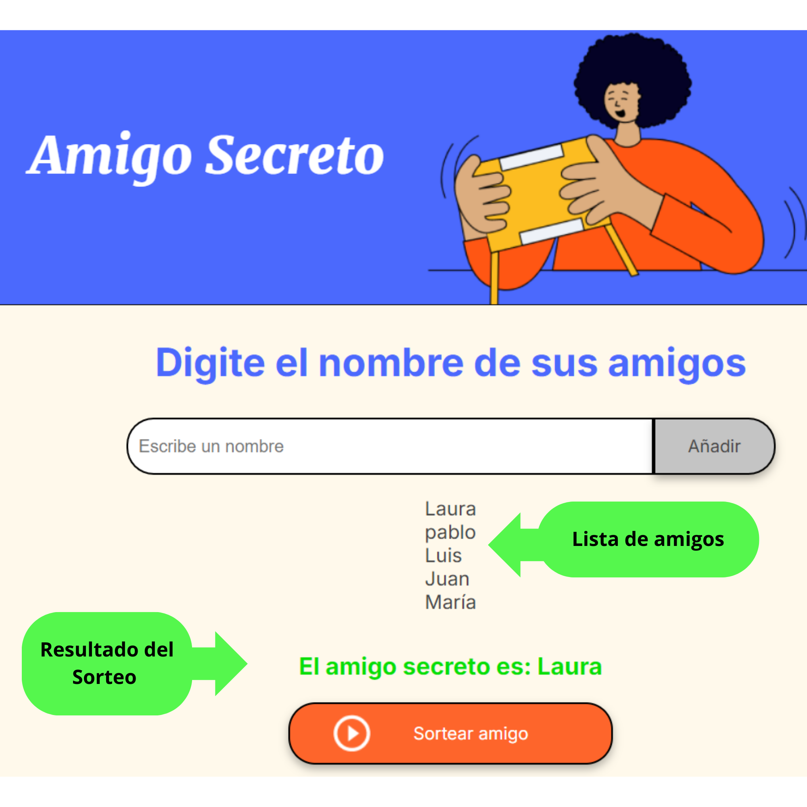

# Desafio1_AmigoSecreto
Aplicación que permite a los usuarios ingresar nombres de amigos en una lista para luego realizar un sorteo aleatorio y determinar quién es el "amigo secreto".

## Índice
1. [Descripción del Proyecto](#descripción-del-proyecto)
2. [Estado del Proyecto](#estado-del-proyecto)
3. [Demostración de Funciones y Aplicaciones](#demostración-de-funciones-y-aplicaciones)
4. [Acceso al Proyecto](#acceso-al-proyecto)
5. [Tecnologías Utilizadas](#tecnologías-utilizadas)
6. [Personas Contribuyentes](#personas-contribuyentes)
7. [Personas Desarrolladoras del Proyecto](#personas-desarrolladoras-del-proyecto)
8. [Licencia](#licencia)

## Descripción del Proyecto
El proyecto "Amigo Secreto" es una aplicación web que permite a los usuarios ingresar nombres de amigos en una lista para luego realizar un sorteo aleatorio y determinar quién es el "amigo secreto". Los usuarios pueden agregar nombres mediante un campo de texto y un botón "Añadir". Al finalizar, un botón "Sortear Amigo" selecciona uno de los nombres de forma aleatoria, mostrando el resultado en pantalla.

## Estado del Proyecto

El proyecto se encuentra en desarrollo. Se han implementado las funcionalidades básicas y se están realizando mejoras y correcciones de errores.

## Demostración de Funciones y Aplicaciones
- **Agregar nombres:** Los usuarios escriben el nombre de un amigo en un campo de texto y lo agregan a una lista visible al hacer clic en "Añadir".
- **Validar entrada:** Si el campo de texto está vacío, el programa muestra una alerta pidiendo un nombre válido.
- **Visualizar la lista:** Los nombres ingresados aparecen en una lista debajo del campo de entrada.
- **Sorteo aleatorio:** Al hacer clic en el botón "Sortear Amigo", se selecciona aleatoriamente un nombre de la lista y se muestra en la página.
  

## Acceso al Proyecto
Puedes acceder al proyecto [aquí](https://github.com/tu-usuario/amigo-secreto).

## Tecnologías Utilizadas
- **HTML:** Estructura de la página web realizado por ALURA.
- **CSS:** Estilos de la página web realizado por ALURA.
- **JavaScript:** Lógica del sorteo y manejo de eventos.

## Personas Contribuyentes
- **[Nombre del Contribuyente](https://github.com/nombre-del-contribuyente):** Archivos HTML y CSS generador por ALURA.

## Personas Desarrolladoras del Proyecto
- **[Tu Nombre](https://github.com/tu-usuario):** JavaScript desarrollado por Liliana Rodriguez.

## Mejoras por hacer
- **limitar el acceso de caracteres en valor de letras, no aceptar números.
